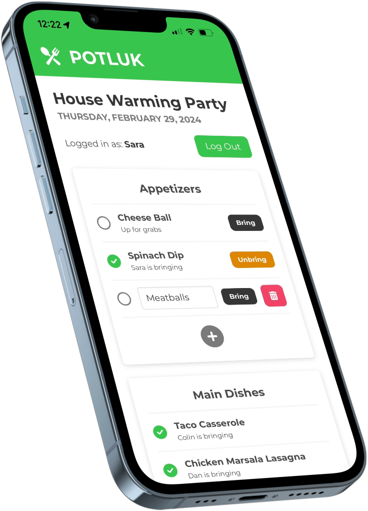

<h1 align="center">Potluk</h1>

<p align="center">Coordinate who brings what to your potluck!</p>

<div align="center">
  <a href="https://github.com/c-o-l-i-n/potluk/actions/workflows/build-and-deploy.yml">
    
  </a>
  <a href="https://codecov.io/gh/c-o-l-i-n/potluk"> 
     
  </a>
  <a href="https://potl.uk">
    
  </a>
  <a href="LICENSE">
    
  </a>
  <a href="https://standardjs.com">
    
  </a>
</div>

<br />
<br />

<p align="center">
  <a href="https://potl.uk">
    
  </a>
</p>

## About

Potluk is the website that makes coordinating food at your event easy. Simply create a new Potluk, share the link with attendees, and everyone fills out what they're bringing. No sign-ups, no ads, no personal data mining, no cost.

### Technology Stack

[](https://nextjs.org/)
[](https://firebase.google.com/)
[](https://pages.cloudflare.com/)
[](https://www.typescriptlang.org/)
[](https://jestjs.io/)
[](https://testing-library.com/)

## Getting Started

### Prerequisites

- [Git](https://git-scm.com/)
- [Node.js](https://nodejs.org/) v14.6 or higher

### Install

```sh
git clone https://github.com/c-o-l-i-n/potluk.git
cd potluk
npm install
```

### Run

```sh
npm run dev
```

## Author

<a href="https://github.com/c-o-l-i-n">
  
</a>

**Colin A. Williams**

Website: [colinaw.com](https://colinaw.com)
<br>
Github: [@c-o-l-i-n](https://github.com/c-o-l-i-n)

<a href="https://www.buymeacoffee.com/colinw"></a>

## Contributing

Contributions, issues, and feature requests are welcome!<br />Feel free to check the [issues page](https://github.com/c-o-l-i-n/potluk/issues).

## License

Copyright © 2023 [Colin A. Williams](https://github.com/c-o-l-i-n).<br /> This project is [MIT](LICENSE) licensed.

"[meal](https://thenounproject.com/icon/meal-1633691/)" icon by [David Khai](https://thenounproject.com/kaxgyatso/) from [Noun Project](https://thenounproject.com/)
